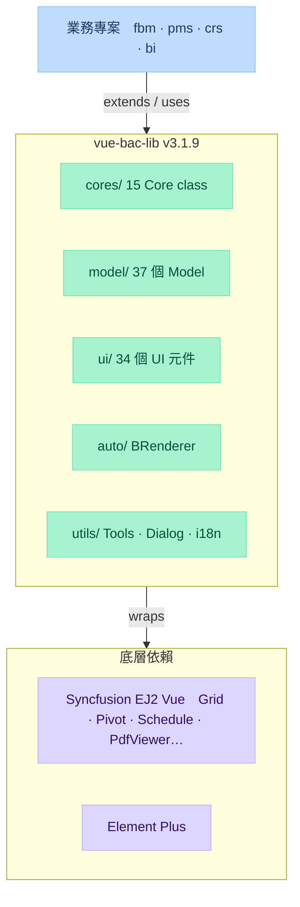

# vue-bac-lib — 總覽

Vue 3 企業級共用元件庫，封裝 Syncfusion EJ2 + Element Plus，提供統一的 Core 類架構與 37 個預定義 Model。

## 架構層次



## 主要 Entry Point

| 檔案                       | 說明                                 |
| ------------------------ | ---------------------------------- |
| `src/index.ts`           | 所有公開 API 的統一入口（265 行）              |
| `src/install.ts`         | Vue Plugin 安裝，呼叫 `app.use(vueLib)` |
| `src/registerLicense.ts` | Syncfusion 授權 Key 注入               |
| `src/context.ts`         | 全局 context（~600 行）                 |
| `src/services.ts`        | 全局服務（~600 行）                       |

## 建置與發布

```bash
yarn build       # vite build → tsc dts → api-extractor → themes → addType
yarn publish     # build + npm publish 到 Nexus
```

- **Nexus 倉庫**：`https://nexus.athena.com.tw/repository/npm-host/`
- **輸出**：`dist/vue-bac-lib.es.js`（ESM）、`dist/vue-bac-lib.cjs.js`（CJS）
- **類型**：`dist/vue-bac-lib.d.ts`（由 api-extractor 合併）

## 使用端安裝（業務專案）

```ts
// main.ts / nuxt plugin
import { install, registerLicense } from 'vue-bac-lib'
import 'vue-bac-lib/dist/themes.scss'

registerLicense('YOUR_SYNCFUSION_KEY')
app.use(install)
```

## 重要決策

- Syncfusion EJ2 全系列深度整合（Grid、PivotView、Schedule、PdfViewer、Dashboard、Chart）
- **命名規範**：Vue 元件用 `B` 前綴（`BButton`），對應 TS Class 用 `Bac` 前綴（`BacButton`）
- Core 類用繼承模式管理複雜頁面狀態，業務專案不直接操作 Syncfusion API
- RxJS 用於 Core 類內部狀態管理（非響應式替代，為程序流控制）

## 已知問題 / 技術債

<!-- 填入實際遇到的問題 -->

## 相關連結

- [[bac-apis]]（API 類型定義來源）
- [[Core類]] — 核心類用途與繼承關係
- [[UI元件]] — 34 個元件速查
- [[Grid欄位元件]] — Grid 內嵌欄位元件
- [[Model 列表]] — 37 個 Model 場景
- [[Auto引擎]] — BRenderer 動態渲染
- [[Utils-Services]] — 工具函數與全局服務
